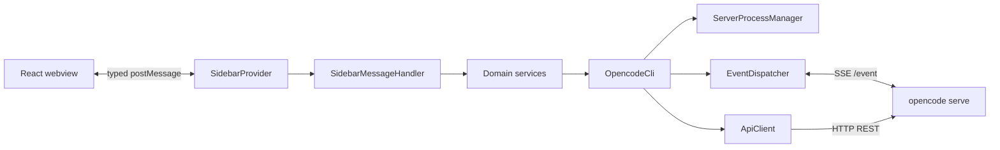

# Architecture

## Overview

Opencode Sidebar Chat is a VS Code extension containing two compilation targets and one local server boundary.

## Compilation Targets

| Target           | Source          | Entry                        | Build output                     |
| ---------------- | --------------- | ---------------------------- | -------------------------------- |
| Extension host   | `src/extension` | `src/extension/extension.ts` | `out/` through `tsc`             |
| Webview          | `src/webview`   | `src/webview/index.tsx`      | `out/webview.js` through esbuild |
| Shared contracts | `src/shared`    | `types.ts`                   | Included by both targets         |

`npm run compile` builds both targets. Extension-host code can use Node.js APIs. Webview code must remain browser-safe and use `src/webview/vscode-api.ts` instead of importing `vscode`.

## Runtime Boundaries

1. VS Code creates `SidebarProvider` and its webview.
2. Webview sends `WebviewToExtensionMessage` values.
3. `SidebarProvider.validateMessage` rejects malformed envelopes and payloads.
4. `SidebarMessageHandler` routes commands to focused services.
5. `OpencodeCli` coordinates local server startup and active sessions.
6. `ApiClient` performs authenticated REST calls.
7. `SseStream` reads `/event`; `EventDispatcher` normalizes events into webview-friendly callbacks.
8. Extension posts `ExtensionToWebviewMessage` values to React state handlers.

## Service Responsibilities

| Service                 | Responsibility                                                        |
| ----------------------- | --------------------------------------------------------------------- |
| `SidebarProvider`       | Webview lifecycle, untrusted message validation, outgoing postMessage |
| `SidebarMessageHandler` | Command routing and application-level coordination                    |
| `SessionService`        | Session creation, loading, deletion, and abort                        |
| `ChatCoordinator`       | Prompt execution and streaming-to-UI event translation                |
| `ContextService`        | Read permission enforcement and context events                        |
| `PermissionService`     | Server permission state and user decisions                            |
| `AuthService`           | Provider credential persistence through SecretStorage                 |
| `SkillService`          | Workspace skill discovery                                             |
| `GitService`            | Git-backed slash command operations                                   |
| `OpencodeCli`           | Public facade and server/session orchestration                        |
| `ServerProcessManager`  | `opencode serve` process discovery, startup, health, shutdown         |
| `ApiClient`             | REST endpoint contract                                                |
| `SseStream`             | Server-sent event connection and parsing                              |
| `EventDispatcher`       | Event filtering, normalization, callbacks                             |
| `WebviewHtmlBuilder`    | Sandboxed HTML, assets, and dynamic CSP                               |

## Data Flow and State

- Extension host owns credentials, process lifecycle, sessions, and server truth.
- Webview owns presentation state only; it does not call Opencode or VS Code APIs directly.
- Shared message unions in `src/shared/types.ts` are the serialization contract.
- Model identifiers use `providerId/modelId` to prevent cross-provider collisions.
- Streaming events are normalized before crossing into React state.

## Security Model

- API keys remain in VS Code SecretStorage and are restored to the local server at activation.
- Webview script execution is enabled only with a strict Content Security Policy scoped to the local server origin.
- Webview messages are validated at extension boundary.
- Read operations matching deny patterns require explicit user permission.
- Opencode server errors must not expose credentials or arbitrary response bodies to the webview.
- Logs must not contain secret values.

## API Contract

`docs/openapi.yaml` documents HTTP operations consumed by `ApiClient`. It is an extension-side compatibility contract, not a copy of the complete upstream Opencode API.

When changing an endpoint:

1. Update `ApiClient` and shared response types.
2. Update `docs/openapi.yaml`.
3. Add success, malformed-response, and error-path tests where practical.
4. Verify compatibility against the supported `opencode-ai` server version.

## Error and Cancellation Rules

- `fetch` and SSE operations receive explicit abort signals where cancellation is supported.
- Non-critical discovery failures return safe empty/null values to preserve UI availability.
- Session mutation and prompt failures propagate actionable errors to webview.
- Server startup tries ordered binary candidates under one shared startup deadline.
- Provider credentials are stored only after the server accepts authentication.

## Testing Strategy

- Unit tests cover normalization, parsing, service behavior, and boundary validation.
- Integration tests cover typed webview-extension message flow.
- Validation gate: `npm test`, `npm run lint`, and `npm run compile`.
